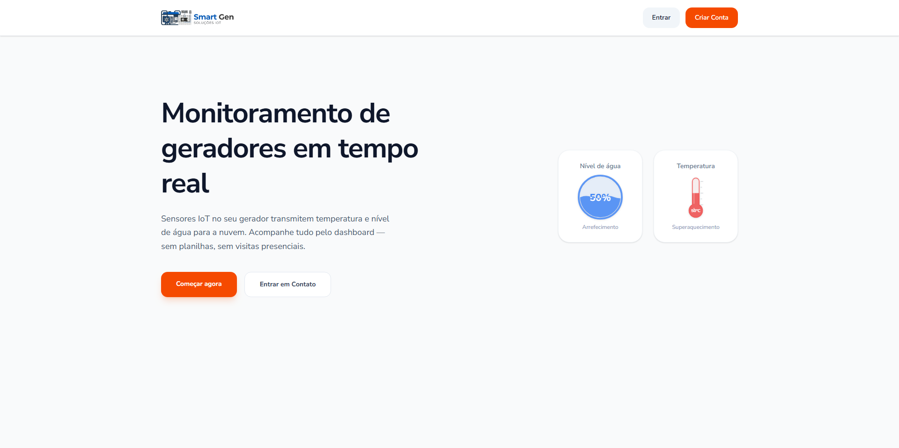
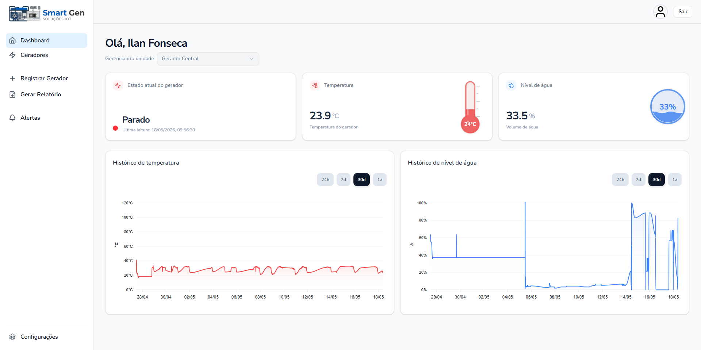
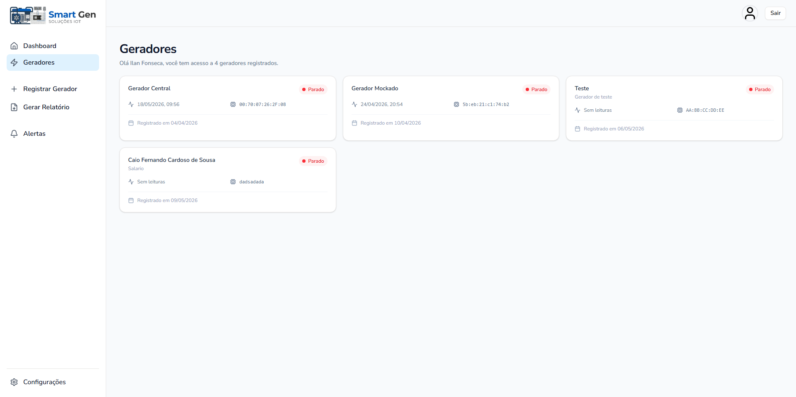
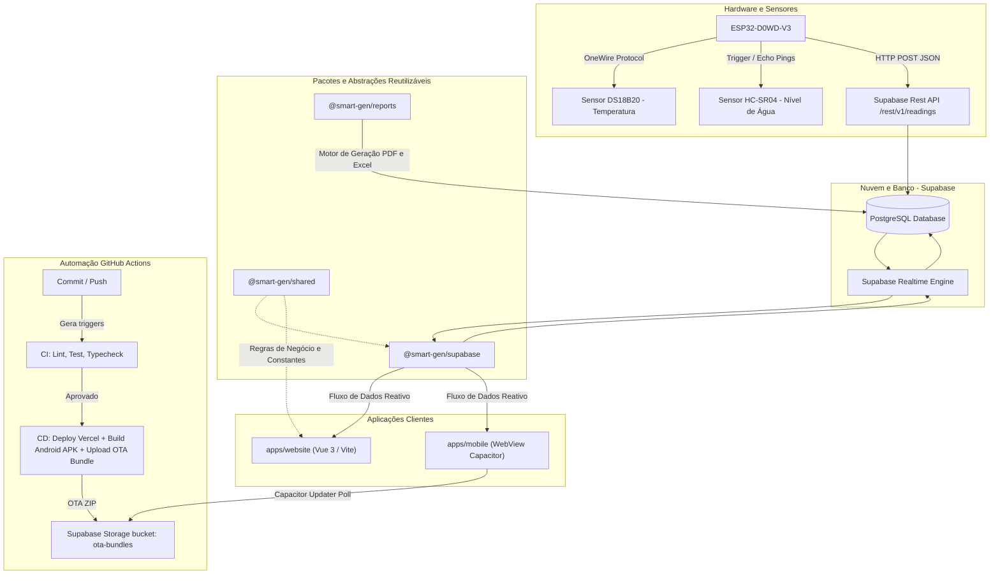

<a id="topo"></a>

# Smart Gen — Sistema de Monitoramento Remoto de Geradores

[](https://github.com/ilanzgx/smart-gen/actions)
[](https://www.gnu.org/licenses/agpl-3.0.html)
[](https://nodejs.org/)
[](https://pnpm.io/)
[](https://tailwindcss.com/)

O **Smart Gen** é um ecossistema completo em formato de protótipo funcional altamente estruturado, desenvolvido para o monitoramento reativo e preventivo de geradores de energia. A sua arquitetura é robusta, modular e elegante, estruturada sob um monorepo desacoplado (**pnpm workspaces**) que é blindado e documentado por **mais de 150 testes automatizados**.

Utilizando o poder de hardware embarcado baseado em **ESP32** (equipado com sensores físicos calibrados **DS18B20** e **HC-SR04**) para aquisição de telemetria em tempo real, **Supabase** para infraestrutura e sincronização de dados instantânea via WebSockets, e interfaces móveis/responsivas de alto polimento (**Vue 3** + **Capacitor Mobile**), o ecossistema permite acompanhar a integridade e saúde operacional de suas unidades sob qualquer circunstância.

<p align="center">
  
  
</p>
<p align="center">
  
  
</p>

---

<!-- @import "[TOC]" {cmd="toc" depthFrom=1 depthTo=6 orderedList=false} -->

## 🗺️ Visão Arquitetural do Ecossistema

O monorepo adota uma arquitetura **Clean & Decoupled** (desacoplada). As aplicações de ponta nunca se comunicam de forma direta ou crua com o banco de dados; todas as interações passam por adaptadores e bibliotecas compartilhadas locais do monorepo.

O fluxo abaixo representa o percurso dos dados, desde a leitura dos sensores analógicos até a renderização e distribuição automatizada de builds:



---

## 🎯 Objetivos de Negócio & Engenharia

- **Monitoramento Preventivo Eficaz:** Prevenir superaquecimentos de motor e falhas críticas por falta de fluidos refrigerantes utilizando telemetria de precisão calibrada.
- **Reatividade Instantânea (Realtime):** Notificar alterações de status operacionais em menos de 500ms através de subscrições via WebSockets estáveis que evitam colisões de concorrência.
- **Deploy Ágil Over-the-Air (OTA):** Atualizar o aplicativo mobile nativo instantaneamente sem requerer re-submissão e aprovações manuais na Google Play ou App Store.
- **Baixo Custo Embarcado:** Hardware robusto, acessível e de baixíssimo consumo energético baseado no chip ESP32.
- **Auditoria e Conformidade:** Motor de relatórios estruturado capaz de exportar logs históricos consolidados em PDF e planilhas eletrônicas Excel.

---

## 🛠️ Stack Tecnológica

| Camada                 | Tecnologia                               | Propósito / Detalhes                                                                |
| :--------------------- | :--------------------------------------- | :---------------------------------------------------------------------------------- |
| **Core Monorepo**      | Node.js v22 & PNPM v10                   | Gerenciamento de dependências via Workspaces rápidos e isolados.                    |
| **Frontend Web**       | Vue 3 (Composition API) & Vite           | SPA moderna de alta performance com carregamento sob demanda.                       |
| **Estilização**        | Tailwind CSS v4 & Lucide Icons           | Estilização por meio da nova engine de compilação baseada em CSS nativo.            |
| **Estado & Rotas**     | Pinia & Vue Router                       | Armazenamento modular reativo (`auth.store`, `generators.store`) e guards de rotas. |
| **Wrapper Mobile**     | Capacitor & @capgo/capacitor-updater     | Empacotamento híbrido nativo com suporte a atualizações OTA dinâmicas.              |
| **Camada de Nuvem**    | Supabase (PostgreSQL, Realtime, Storage) | Autenticação unificada, banco de dados seguro e WebSockets nativos.                 |
| **Hardware**           | C++ (Framework Arduino / ESP-IDF)        | Loop de telemetria otimizado no chip ESP32 com conexões de Wi-Fi redundantes.       |
| **Relatórios**         | `pdf-lib` & `exceljs`                    | Geração sob demanda de documentos formatados de auditoria.                          |
| **Qualidade & Testes** | Vitest, ESLint, OxLint, Prettier & Husky | Análise estática ultrarrápida, formatação rigorosa e testes automatizados.          |

---

## 📂 Organização Interna do Monorepo

```bash
smart-gen/
├── apps/                         # Aplicações Finais Declaradas
│   ├── website/                  # Interface web principal Vue 3 + Tailwind v4 + Pinia
│   └── mobile/                   # Invólucro nativo Capacitor com controle de OTA
├── packages/                     # Pacotes de Compartilhamento Local
│   ├── @smart-gen/shared         # Utilitários puros de lógica, constantes e schemas de validação Zod
│   ├── @smart-gen/supabase       # Data Access Layer isolada: recursos de banco de dados e WebSockets
│   ├── @smart-gen/reports        # Serviço de geração e compilação de relatórios (PDF/Excel)
│   └── @smart-gen/tsconfig       # Configurações TypeScript padronizadas (Base, Node, Vue, Vitest)
├── firmware/                     # Código embarcado C++ para o chip ESP32
│   ├── firmware.ino              # Inicialização do loop e orquestração dos sensores
│   ├── smartgen_sensors.cpp      # Lógica de temporização e calibração do DS18B20 e HC-SR04
│   ├── smartgen_supabase.cpp     # Chamadas REST seguras de persistência no Supabase
│   └── smartgen_wifi.cpp         # Gestão de conexão Wi-Fi resiliente com redes redundantes
├── scripts/                      # Automatizadores de empacotamento
│   └── upload-ota-bundle.mjs     # Compactador do front-end e dispatcher para o bucket de OTA
├── .github/workflows/            # Esteira de CI/CD automatizada do GitHub Actions
└── package.json                  # Scripts globais de orquestração do monorepo
```

---

## 🚀 Como Começar (Guia Prático)

### 1. Clonar e Inicializar Dependências

```bash
git clone https://github.com/ilanzgx/smart-gen.git
cd smart-gen

# Configure a ramificação de desenvolvimento ativa
git checkout develop

# Sincronize o repositório local e baixe todas as dependências
pnpm run sync
```

### 2. Configurar Variáveis de Ambiente

Copie os modelos de ambiente de desenvolvimento e preencha com suas respectivas credenciais secretas obtidas no painel do Supabase:

- **Para a Interface Web (`apps/website/.env`):**

  ```bash
  VITE_SUPABASE_URL=https://sua-url-projeto.supabase.co
  VITE_SUPABASE_ANON_KEY=sua-chave-anonima-publica
  ```

- **Para o Script de Deploy OTA (`scripts/upload-ota-bundle.mjs`):**
  ```bash
  SUPABASE_URL=https://sua-url-projeto.supabase.co
  SUPABASE_SERVICE_ROLE_KEY=sua-chave-service-role-superprivilegiada
  ```

### 3. Rodar em Ambiente de Desenvolvimento

Execute todas as aplicações em paralelo com apenas um comando a partir da raiz:

```bash
pnpm dev
```

Para inicializar apenas uma aplicação específica (ex: interface web):

```bash
pnpm --filter @smart-gen/website dev
```

---

## 🛡️ Variáveis de Ambiente de Produção & CI/CD

Para o correto funcionamento do ecossistema de deploys contínuos e canais de atualização, as seguintes variáveis precisam estar cadastradas nos segredos do repositório (**GitHub Secrets**):

| Escopo              | Variável                    | Descrição                                           | Exemplo                   |
| :------------------ | :-------------------------- | :-------------------------------------------------- | :------------------------ |
| **Pipeline Global** | `SUPABASE_URL`              | URL de conexão do cluster Supabase.                 | `https://xyz.supabase.co` |
| **Pipeline Global** | `SUPABASE_SERVICE_ROLE_KEY` | Chave de serviço com bypass de RLS para upload OTA. | `eyJhbGciOiJIUzI1...`     |
| **CD Website**      | `VERCEL_ORG_ID`             | Identificador da organização Vercel.                | `team_abc123`             |
| **CD Website**      | `VERCEL_PROJECT_ID`         | Identificador do projeto na Vercel.                 | `prj_xyz456`              |
| **CD Website**      | `VERCEL_TOKEN`              | Token de autorização para deploys via CLI.          | `aBcD123...`              |

---

## 📐 Regras de Arquitetura e Padrões de Código

Para garantir a coesão do ecossistema, os desenvolvedores e agentes de IA devem seguir rigorosamente as regras abaixo:

1.  **Sem Supabase no Front-End Direto:** O diretório `apps/website` **nunca** deve importar `@supabase/supabase-js`. Ele deve consumir apenas as assinaturas, mutations e queries expostas pelo pacote local `@smart-gen/supabase`.
2.  **Validações Puras no Shared:** Funções auxiliares sem efeitos colaterais e validações estruturais Zod devem residir exclusivamente em `packages/shared` para livre importação.
3.  **Realtime sem Conflitos:** Assinaturas de WebSocket de telemetria usam sufixos numéricos dinâmicos para evitar colisões no servidor com canais antigos que estão em processo de desconexão (`LEAVING`).
4.  **Husky & Linters:** O Husky executa checagem estática rigorosa antes de cada commit. Use `pnpm run ready` antes de submeter uma nova Pull Request (PR) para garantir que testes unitários e tipos passem localmente.

---

## 🧪 Estrutura de Testes Automatizados

O ecossistema do **Smart Gen** preza pela estabilidade rigorosa e qualidade extrema de entrega. A arquitetura modular do monorepo é blindada por **mais de 150 testes automatizados** (exatamente **151 testes unitários e de integração** no total) rodando a cada commit via Git Hooks e GitHub Actions.

Essa suíte de testes garante que nenhuma alteração introduza regressões em nenhuma das camadas:

*   **`apps/website`:** Validação de stores reativas (Pinia), Guards de Rotas, fluxos de autenticação e o comportamento do serviço de atualização OTA.
*   **`packages/supabase`:** Cobertura de serviços de autenticação, queries de recuperação, mutations e o gerenciamento de subscrições em tempo real.
*   **`packages/shared`:** Validação estrita de contratos de dados e schemas Zod (Cadastro, Login e Recuperação de Senha).
*   **`packages/reports`:** Testes de geração e estruturação do motor de relatórios.

O projeto utiliza o **Vitest** rodando sobre o ambiente `jsdom` para emulação veloz de DOM e runners de alto paralelismo.

Para executar os testes de maneira focada ou global:

```bash
# Executa todos os testes de todos os pacotes do monorepo
pnpm test

# Testes apenas do pacote de dados (Supabase)
pnpm --filter @smart-gen/supabase test:unit

# Testes apenas da aplicação web (Website)
pnpm --filter @smart-gen/website test:unit
```

---

## 🔄 Fluxo de Atualização OTA (Over-the-Air)

O aplicativo mobile utiliza o `@capgo/capacitor-updater` configurado em modo **Manual/Deferred** (`autoUpdate: false`). O fluxo ocorre de forma silenciosa para não interromper a navegação do usuário:

1.  Um commit é mesclado na branch `main`.
2.  O GitHub Actions compila o front-end web de produção.
3.  O script `upload-ota-bundle.mjs` compacta o build, gera o arquivo de metadados `version.json` usando o hash do commit (`GITHUB_SHA`), e envia os arquivos ao Supabase Storage.
4.  Ao iniciar, o aplicativo nativo detecta a atualização, baixa o pacote em segundo plano e realiza a substituição dinâmica de arquivos de forma transparente.

---

[Voltar ao topo ⬆️](#topo)
